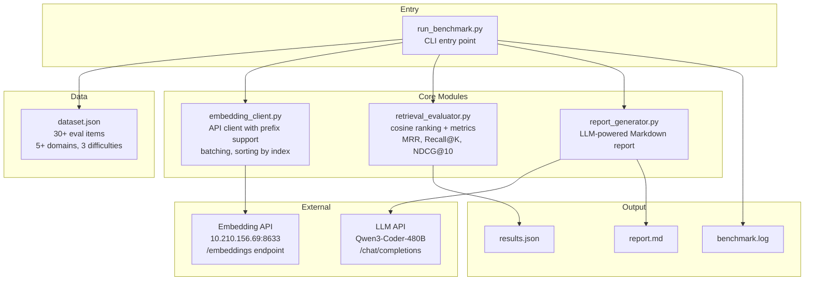
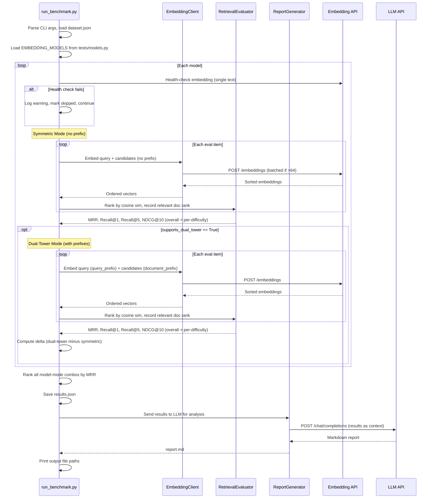

# Design Document: Dual-Tower Retrieval Benchmark

## Overview

This feature builds a standalone retrieval-oriented benchmark that evaluates embedding models under two encoding modes — **symmetric** (no prefix) and **dual-tower/asymmetric** (with query/document prefixes) — using standard information-retrieval metrics rather than end-to-end GraphRAG pipeline evaluation.

The existing `tests/test_dual_tower_support.py` only compares a single query–document pair via cosine similarity, which cannot measure ranking quality. The existing `tests/run_embedding_benchmark.py` evaluates models through the full GraphRAG pipeline (Phase 1-9 + Phase 10 + Local Search + ROUGE-L/Answer Correctness), which conflates embedding quality with LLM generation quality and graph traversal effects.

This benchmark takes a fundamentally different approach: it constructs a curated multi-domain English dataset with one relevant document and multiple distractors per query, directly computes retrieval ranking metrics (MRR, Recall@1, Recall@5, NDCG@10), and compares models cross-wise in both symmetric and dual-tower modes. An LLM generates a structured Markdown analysis report from the results.

Key design decisions:
- **Pure retrieval evaluation**: No LLM generation step — metrics are computed directly from embedding-based ranking, isolating embedding quality from other variables
- **Dual-mode comparison**: Every model runs in symmetric mode; models with `supports_dual_tower=True` also run in dual-tower mode with their configured prefixes
- **Reuse existing infrastructure**: Imports `EmbeddingModelConfig` and `EMBEDDING_MODELS` from `tests/models.py`, uses the same API endpoint (`http://10.210.156.69:8633`)
- **Self-contained code**: All new code under `tests/embedding-benchmark/`, no modifications to existing files

## Architecture

### System Architecture



### Execution Flow



## Components and Interfaces

### 1. Evaluation Dataset (`tests/embedding-benchmark/dataset.json`)

A static JSON file containing 30+ evaluation items across 5+ domains and 3 difficulty levels.

Schema:
```json
[
  {
    "query": "What is the primary function of mitochondria?",
    "relevant_doc": "Mitochondria are membrane-bound organelles found in the cytoplasm of eukaryotic cells. They are often referred to as the powerhouses of the cell because they generate most of the cell's supply of adenosine triphosphate (ATP), used as a source of chemical energy.",
    "distractor_docs": [
      "The endoplasmic reticulum is a network of membranes...",
      "Ribosomes are macromolecular machines that perform...",
      "..."
    ],
    "domain": "science",
    "difficulty": "easy"
  }
]
```

Domains: science, history, technology, medicine, law (minimum 5).
Difficulty levels:
- `"easy"`: Distractors from clearly different topics
- `"medium"`: Distractors from the same broad domain
- `"hard"`: Distractors from the same narrow sub-topic

Each item has 1 relevant_doc and 7–19 distractor_docs. All text in English.

### 2. Embedding Client (`tests/embedding-benchmark/embedding_client.py`)

```python
class EmbeddingClient:
    """OpenAI-compatible embedding client with prefix support and batching."""

    def __init__(self, api_base: str, timeout: int = 120):
        ...

    def get_embeddings(
        self,
        model: str,
        texts: list[str],
        prefix: str = "",
    ) -> list[list[float]]:
        """Embed texts with optional prefix prepended to each.

        - Prepends `prefix` to each text before sending
        - Splits into batches of 64 if len(texts) > 64
        - Sorts response `data` array by `index` field
        - Returns embedding vectors in input order
        - Raises EmbeddingAPIError on 4xx/5xx with model name, status, body
        """
        ...
```

Key behaviors:
- Batch size: 64 texts per API call
- Timeout: 120 seconds per call
- Response ordering: sort by `data[].index` before extracting vectors
- Error handling: raises `EmbeddingAPIError(model, status_code, response_body)` on HTTP errors

### 3. Retrieval Evaluator (`tests/embedding-benchmark/retrieval_evaluator.py`)

```python
class RetrievalEvaluator:
    """Ranks candidates by cosine similarity and computes IR metrics."""

    @staticmethod
    def rank_candidates(
        query_embedding: list[float],
        candidate_embeddings: list[list[float]],
        relevant_index: int,
    ) -> int:
        """Return 1-based rank of the relevant document among candidates."""
        ...

    @staticmethod
    def compute_metrics(
        ranks: list[int],
        total_candidates_per_query: list[int],
    ) -> dict:
        """Compute MRR, Recall@1, Recall@5, NDCG@10 from a list of ranks.

        Returns: {"mrr": float, "recall_at_1": float, "recall_at_5": float, "ndcg_at_10": float}
        """
        ...

    @staticmethod
    def compute_metrics_by_difficulty(
        ranks: list[int],
        total_candidates_per_query: list[int],
        difficulties: list[str],
    ) -> dict[str, dict]:
        """Compute metrics grouped by difficulty level.

        Returns: {"easy": {...}, "medium": {...}, "hard": {...}, "overall": {...}}
        """
        ...
```

Metric definitions:
- **MRR**: Mean of `1/rank` across all queries
- **Recall@K**: Fraction of queries where relevant doc is in top-K
- **NDCG@10**: Normalized Discounted Cumulative Gain at cutoff 10, with binary relevance (relevant_doc=1, distractors=0)

### 4. Report Generator (`tests/embedding-benchmark/report_generator.py`)

```python
class ReportGenerator:
    """Generates LLM-analyzed Markdown report from benchmark results."""

    def __init__(self, api_base: str, model: str, timeout: int = 300):
        ...

    def generate_report(self, results: dict) -> str:
        """Send results to LLM, return Markdown report.

        LLM is instructed to produce sections:
        - Executive Summary
        - Methodology
        - Results Table (all models × all metrics)
        - Dual-Tower vs Symmetric Analysis
        - Per-Difficulty Breakdown
        - Model Rankings
        - Recommendations

        Falls back to template report if LLM call fails.
        """
        ...

    @staticmethod
    def generate_fallback_report(results: dict) -> str:
        """Generate basic template report without LLM analysis."""
        ...
```

### 5. Benchmark Runner (`tests/embedding-benchmark/run_benchmark.py`)

Entry point that orchestrates the full benchmark:

```python
def main():
    """CLI entry point.

    Args (optional):
        --models: Comma-separated model names (default: all from EMBEDDING_MODELS)
        --output-dir: Output directory (default: tests/embedding-benchmark/)
    """
    ...
```

Orchestration flow:
1. Parse CLI args, configure logging (stdout + `benchmark.log`)
2. Load `dataset.json`
3. Import `EMBEDDING_MODELS` from `tests/models.py`
4. Filter models by `--models` arg if provided
5. For each model: health-check → symmetric eval → (optional) dual-tower eval
6. Compute delta rows for dual-tower models
7. Rank by MRR descending
8. Save `results.json`
9. Generate `report.md` via LLM
10. Print output file paths

## Data Models

### Input Data

```python
@dataclass
class EvalItem:
    query: str
    relevant_doc: str
    distractor_docs: list[str]
    domain: str
    difficulty: str  # "easy" | "medium" | "hard"
```

### Results Data

```python
@dataclass
class ModelModeResult:
    model_display_name: str
    model_name: str
    mode: str  # "symmetric" | "dual-tower"
    metrics: dict  # {"mrr": float, "recall_at_1": float, "recall_at_5": float, "ndcg_at_10": float}
    metrics_by_difficulty: dict[str, dict]  # {"easy": {...}, "medium": {...}, "hard": {...}}
    embedding_time_seconds: float
    status: str  # "completed" | "unavailable" | "error"
    error_message: str | None

@dataclass
class DeltaRow:
    model_display_name: str
    model_name: str
    delta_mrr: float
    delta_recall_at_1: float
    delta_recall_at_5: float
    delta_ndcg_at_10: float

@dataclass
class BenchmarkResults:
    results: list[ModelModeResult]  # sorted by MRR descending
    deltas: list[DeltaRow]
    skipped_models: list[dict]  # [{"model": str, "reason": str}]
    timestamp: str
    dataset_stats: dict  # {"total_items": int, "domains": list, "difficulty_distribution": dict}
```

### Output File: `results.json`

```json
{
  "results": [
    {
      "model_display_name": "BGE-M3 (default)",
      "model_name": "BAAI/bge-m3",
      "mode": "symmetric",
      "metrics": {"mrr": 0.85, "recall_at_1": 0.73, "recall_at_5": 0.93, "ndcg_at_10": 0.88},
      "metrics_by_difficulty": {
        "easy": {"mrr": 0.95, ...},
        "medium": {"mrr": 0.82, ...},
        "hard": {"mrr": 0.71, ...}
      },
      "embedding_time_seconds": 12.3,
      "status": "completed",
      "error_message": null
    }
  ],
  "deltas": [
    {
      "model_display_name": "BGE-M3 (default)",
      "model_name": "BAAI/bge-m3",
      "delta_mrr": 0.05,
      "delta_recall_at_1": 0.03,
      "delta_recall_at_5": 0.02,
      "delta_ndcg_at_10": 0.04
    }
  ],
  "skipped_models": [
    {"model": "Qwen3-Emb-8B-Alt", "reason": "HTTP 500 on health check"}
  ],
  "timestamp": "2025-07-14T10:30:00",
  "dataset_stats": {
    "total_items": 35,
    "domains": ["science", "history", "technology", "medicine", "law"],
    "difficulty_distribution": {"easy": 12, "medium": 12, "hard": 11}
  }
}
```

### Output Directory Structure

```
tests/embedding-benchmark/
├── run_benchmark.py          # Entry point
├── embedding_client.py       # API client
├── retrieval_evaluator.py    # Ranking + metrics
├── report_generator.py       # LLM report generation
├── dataset.json              # Evaluation dataset
├── results.json              # Benchmark results (generated)
├── report.md                 # LLM analysis report (generated)
└── benchmark.log             # Run log (generated)
```

## Correctness Properties

*A property is a characteristic or behavior that should hold true across all valid executions of a system — essentially, a formal statement about what the system should do. Properties serve as the bridge between human-readable specifications and machine-verifiable correctness guarantees.*

### Property 1: Eval item structural validity

*For any* eval item in the dataset, it SHALL have exactly one non-empty query string, one non-empty relevant_doc string, and between 7 and 19 distractor_doc strings (each non-empty), a domain string, and a difficulty string in {"easy", "medium", "hard"}.

**Validates: Requirements 1.2, 1.5, 1.6**

### Property 2: Embedding response reordering preserves input correspondence

*For any* list of input texts and any permutation of the API response `data` array (where each element has an `index` field corresponding to the original input position), sorting by `index` and extracting embeddings SHALL produce vectors in the same order as the input texts.

**Validates: Requirements 2.2**

### Property 3: Prefix is prepended to every input text

*For any* non-empty prefix string and any list of input texts, the texts sent to the API SHALL each equal `prefix + original_text`. When prefix is empty, texts SHALL be sent unchanged.

**Validates: Requirements 2.3**

### Property 4: HTTP errors produce descriptive exceptions

*For any* HTTP error status code in the range 400–599, the Embedding_Client SHALL raise an exception whose message contains the model name, the status code, and the response body.

**Validates: Requirements 2.5**

### Property 5: Batching splits correctly and preserves order

*For any* list of N input texts where N > 0, the Embedding_Client SHALL make `ceil(N / 64)` API calls, each with at most 64 texts, and the concatenated result SHALL have exactly N embeddings in the original input order.

**Validates: Requirements 2.6**

### Property 6: Candidates are ranked by descending cosine similarity

*For any* query embedding vector and list of candidate embedding vectors, the ranking produced by the Retrieval_Evaluator SHALL order candidates by descending cosine similarity to the query, and the reported rank of the relevant document SHALL equal its 1-based position in this ordering.

**Validates: Requirements 3.3**

### Property 7: IR metric computation correctness

*For any* list of 1-based ranks (each rank ≥ 1) and corresponding candidate counts, the computed metrics SHALL satisfy: MRR = mean(1/rank), Recall@K = count(rank ≤ K) / len(ranks), and NDCG@10 follows the standard formula with binary relevance.

**Validates: Requirements 3.4**

### Property 8: Per-difficulty metrics equal filtered-subset metrics

*For any* set of (rank, difficulty) pairs, the metrics computed for difficulty level D SHALL equal the metrics computed on the subset of ranks where difficulty == D. The "overall" metrics SHALL equal the metrics computed on all ranks.

**Validates: Requirements 3.5**

### Property 9: Results are sorted by MRR descending

*For any* set of completed model-mode results, the output results list SHALL be ordered by MRR in non-increasing order.

**Validates: Requirements 4.3**

### Property 10: Delta row equals dual-tower minus symmetric

*For any* model that has both symmetric and dual-tower results, the delta row SHALL have `delta_metric = dual_tower_metric - symmetric_metric` for each of MRR, Recall@1, Recall@5, and NDCG@10.

**Validates: Requirements 4.4**

### Property 11: Model fault isolation

*For any* set of models where a subset fails (health check failure, HTTP 4xx, or HTTP 5xx), the Benchmark_Runner SHALL produce complete results for all non-failing models, and the `skipped_models` array SHALL contain exactly the failing models with their failure reasons.

**Validates: Requirements 6.1, 6.2, 6.3, 6.6**

## Error Handling

| Error Scenario | Handling Strategy |
|---|---|
| Embedding API returns 5xx for a model | Log warning, mark model as "unavailable" in `skipped_models`, continue with next model |
| Embedding API returns 4xx for a model | Log error with response body, mark model as "error" in `skipped_models`, continue with next model |
| Health-check fails for a model | Skip model entirely, add to `skipped_models` with reason |
| All models fail health check | Exit with non-zero return code and descriptive error message |
| Embedding API timeout (>120s) | Treat as model failure, mark as "error", continue |
| Input list > 64 texts | Automatically batch into groups of 64, sequential API calls |
| LLM report generation fails | Fall back to template-based report from raw results data |
| LLM report generation timeout (>300s) | Fall back to template-based report |
| Dataset file missing or invalid JSON | Exit with descriptive error (dataset is required) |
| Single eval item embedding fails mid-run | Log error, skip that item, continue with remaining items |

Logging strategy:
- All progress and errors logged to both stdout and `tests/embedding-benchmark/benchmark.log`
- Progress summary printed after each model completes (model name, mode, computed metrics)
- Final output prints paths to `results.json` and `report.md`

## Testing Strategy

### Property-Based Tests

Use `pytest` + `hypothesis` with minimum 100 iterations per property.

| Property | Test Target | Generator Strategy |
|---|---|---|
| Property 1 | Dataset validation | Generate random eval items with varying distractor counts, domains, difficulties |
| Property 2 | `EmbeddingClient` response sorting | Generate random embedding responses with shuffled index values |
| Property 3 | `EmbeddingClient` prefix prepend | Generate random prefix strings and text lists |
| Property 4 | `EmbeddingClient` error handling | Generate random HTTP error codes (400-599) with random response bodies |
| Property 5 | `EmbeddingClient` batching | Generate random text lists of size 1-200, mock API, verify call count and order |
| Property 6 | `RetrievalEvaluator.rank_candidates` | Generate random embedding vectors (query + candidates), verify ranking |
| Property 7 | `RetrievalEvaluator.compute_metrics` | Generate random rank lists, verify against reference implementations |
| Property 8 | `RetrievalEvaluator.compute_metrics_by_difficulty` | Generate random (rank, difficulty) pairs, verify grouping |
| Property 9 | Results sorting | Generate random ModelModeResult lists, verify MRR sort |
| Property 10 | Delta computation | Generate random symmetric/dual-tower metric pairs, verify delta arithmetic |
| Property 11 | Fault isolation | Generate random model lists with failure injection, verify isolation |

### Unit Tests (Example-Based)

| Test | Description |
|---|---|
| Dataset file exists | Verify `tests/embedding-benchmark/dataset.json` exists and parses |
| Dataset has 30+ items | Verify minimum item count |
| Dataset has 5+ domains | Verify domain diversity |
| Dataset has 3 difficulty levels | Verify all three levels present |
| CLI --models filtering | Verify only specified models are evaluated |
| CLI --output-dir | Verify output goes to specified directory |
| LLM fallback report | Mock LLM failure, verify template report is generated |
| Health check before eval | Verify health check runs before full evaluation |
| All-fail exit code | Mock all models failing, verify non-zero exit |

### Integration Tests

| Test | Description |
|---|---|
| End-to-end with mock API | Run full benchmark with mocked embedding API, verify results.json and report.md |
| Single model smoke test | Run with `--models "BAAI/bge-m3"` against live API (if available) |

### Test Configuration

- Property-based testing library: `hypothesis` (Python)
- Minimum iterations: 100 per property test
- Tag format: `Feature: dual-tower-retrieval-benchmark, Property {N}: {title}`
- Test file location: `tests/embedding-benchmark/test_benchmark.py`
