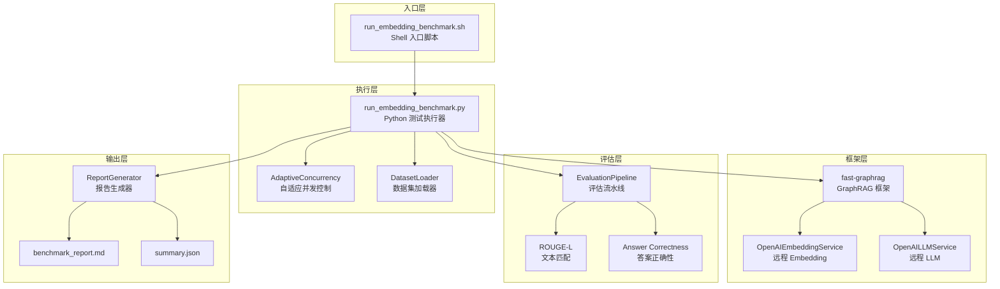
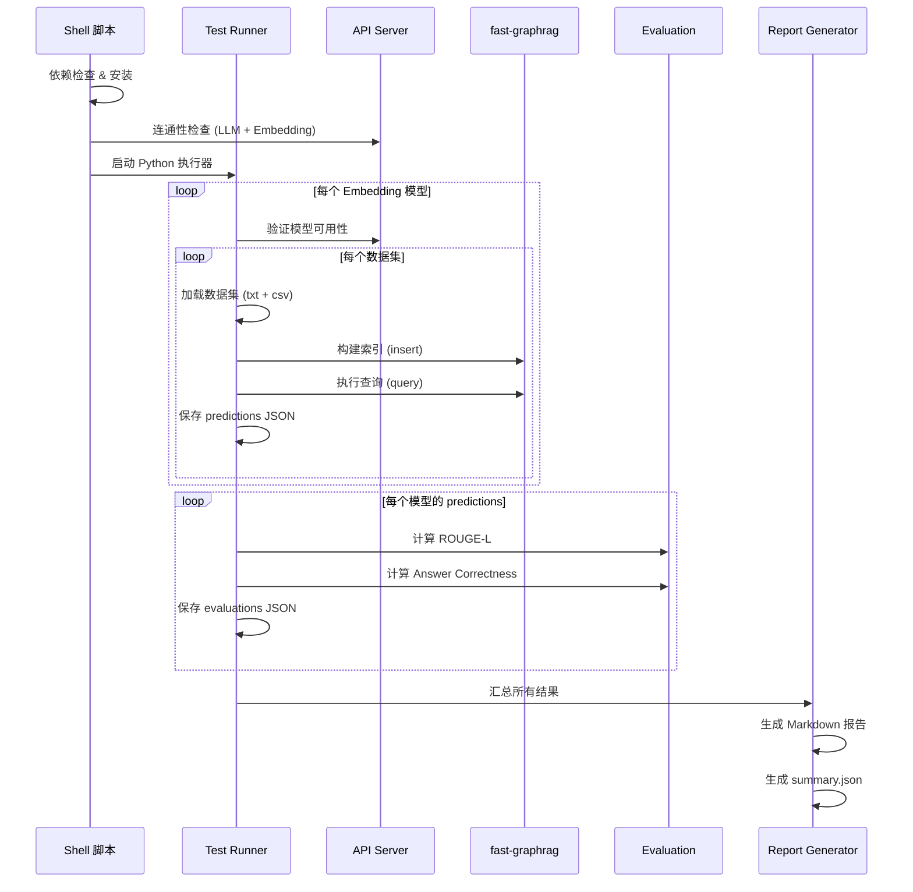

# 设计文档：Embedding 模型基准测试

## 概述

本设计文档描述了一个自动化 Embedding 模型基准测试系统的技术方案。该系统通过一键 Shell 脚本入口，驱动 Python 测试执行器遍历 8 个 Embedding 模型（含 BGE-M3 三种模式），在 4 个数据集上使用 fast-graphrag 框架构建索引并执行查询，然后利用 GraphRAG-Benchmark 评估框架计算 ROUGE-L 和 Answer Correctness 指标，最终生成结构化 Markdown 对比报告。

系统核心设计决策：
- **复用现有基础设施**：基于 `run_fast_graphrag_test.py` 的自适应并发控制和 `run_test.sh` 的 Shell 编排模式
- **远程 API 统一接入**：所有 Embedding 和 LLM 调用均通过 `http://10.210.156.69:8633` 的 OpenAI 兼容 API，无需本地模型
- **容错优先**：单个模型/数据集失败不影响整体流程，最终报告中标注失败项
- **CSV 数据集适配**：与现有 parquet 格式的 GraphRAG-Benchmark 数据集不同，本系统使用 `graphrag-benchmarking-datasets/data` 下的 CSV 问题文件和 txt 文本文件

## 架构

### 整体架构



### 执行流程



## 组件与接口

### 1. Shell 入口脚本 (`tests/run_embedding_benchmark.sh`)

职责：环境准备、参数解析、依赖检查、API 连通性验证、调用 Python 执行器。

```bash
# 命令行接口
bash tests/run_embedding_benchmark.sh [OPTIONS]
  --sample N          # 每个数据集采样问题数，默认 5
  --dataset NAME      # 数据集选择：kevin_scott|msft_multi|msft_single|hotpotqa|all，默认 kevin_scott
  --models "M1,M2"    # 逗号分隔的模型列表，默认全部 8 个模型
```

### 2. Python 测试执行器 (`tests/run_embedding_benchmark.py`)

核心模块，包含以下类和函数：

#### `AdaptiveConcurrencyController`

复用 `run_fast_graphrag_test.py` 的自适应并发控制模式，通过 monkey-patch `httpx.AsyncClient.send` 实现全局节流。

```python
class AdaptiveConcurrencyController:
    """自适应并发控制器"""
    def __init__(self, init: int = 10, min_val: int = 2, max_val: int = 50):
        ...
    def adjust(self, is_error: bool) -> None:
        """5xx 时并发 -1，连续 5 次成功时并发 +1"""
        ...
    def install_hooks(self) -> None:
        """Monkey-patch httpx.AsyncClient 注入节流和计时"""
        ...
```

#### `DatasetLoader`

负责从 `graphrag-benchmarking-datasets/data/` 加载不同格式的数据集。

```python
class DatasetLoader:
    """数据集加载器"""
    @staticmethod
    def load_kevin_scott(base_path: str) -> DatasetResult:
        """加载 Kevin Scott 数据集，合并同一 Episode 的 part 文件"""
        ...
    @staticmethod
    def load_msft(base_path: str, question_type: str) -> DatasetResult:
        """加载 MSFT 数据集 (multi/single)"""
        ...
    @staticmethod
    def load_hotpotqa(base_path: str) -> DatasetResult:
        """加载 HotPotQA 数据集"""
        ...
```

#### `BenchmarkRunner`

编排整个测试流程的主类。

```python
class BenchmarkRunner:
    """基准测试执行器"""
    def __init__(self, config: BenchmarkConfig):
        ...
    async def run(self) -> BenchmarkSummary:
        """执行完整基准测试流程"""
        ...
    async def run_single_model(self, model: EmbeddingModelConfig, dataset: DatasetResult) -> ModelResult:
        """对单个模型执行索引构建 + 查询 + 评估"""
        ...
    async def evaluate_predictions(self, predictions: List[dict], model_name: str) -> EvaluationResult:
        """使用 GraphRAG-Benchmark 评估框架计算指标"""
        ...
```

#### `ReportGenerator`

生成 Markdown 报告和 JSON 汇总。

```python
class ReportGenerator:
    """报告生成器"""
    @staticmethod
    def generate_markdown(summary: BenchmarkSummary) -> str:
        """生成 Markdown 格式的对比报告"""
        ...
    @staticmethod
    def generate_summary_json(summary: BenchmarkSummary) -> dict:
        """生成 JSON 格式的汇总数据"""
        ...
```

### 3. 评估集成

直接调用 `GraphRAG-Benchmark/Evaluation/metrics/` 下的现有实现：

```python
# ROUGE-L：纯文本匹配，不依赖 LLM
from Evaluation.metrics.rouge import compute_rouge_score

# Answer Correctness：75% 事实性(LLM) + 25% 语义相似度(Embedding)
from Evaluation.metrics.answer_accuracy import compute_answer_correctness
```

评估用 LLM 使用 `langchain_openai.ChatOpenAI` 连接同一 API 服务器，Embedding 使用 `langchain_openai.OpenAIEmbeddings` 连接同一 API 服务器（而非本地 HuggingFace 模型，因为我们测试的就是远程 Embedding 服务）。

### 4. 与 fast-graphrag 的集成

```python
from fast_graphrag import GraphRAG
from fast_graphrag._llm import OpenAILLMService, OpenAIEmbeddingService

# 每个 Embedding 模型创建独立的 GraphRAG 实例
def create_graphrag_instance(model_config: EmbeddingModelConfig, workspace: str) -> GraphRAG:
    embedding_service = OpenAIEmbeddingService(
        model=model_config.name,
        base_url="http://10.210.156.69:8633",
        api_key="no-key",
        embedding_dim=model_config.dim,
    )
    llm_service = OpenAILLMService(
        model="Qwen/Qwen3-Coder-480B-A35B-Instruct-FP8",
        base_url="http://10.210.156.69:8633",
        api_key="no-key",
    )
    return GraphRAG(
        working_dir=workspace,
        domain=DOMAIN,
        example_queries=EXAMPLE_QUERIES,
        entity_types=ENTITY_TYPES,
        config=GraphRAG.Config(
            llm_service=llm_service,
            embedding_service=embedding_service,
        ),
    )
```

## 数据模型

### 配置数据模型

```python
@dataclass
class EmbeddingModelConfig:
    """Embedding 模型配置"""
    name: str           # 模型名称，如 "BAAI/bge-m3"
    dim: int            # Embedding 维度
    max_tokens: int     # 最大 Token 数
    display_name: str   # 报告中显示的名称

# 8 个待测模型
EMBEDDING_MODELS = [
    EmbeddingModelConfig("BAAI/bge-m3", 1024, 8192, "BGE-M3 (default)"),
    EmbeddingModelConfig("BAAI/bge-m3/heavy", 1024, 8192, "BGE-M3 (heavy)"),
    EmbeddingModelConfig("BAAI/bge-m3/interactive", 1024, 8192, "BGE-M3 (interactive)"),
    EmbeddingModelConfig("intfloat/e5-mistral-7b-instruct", 4096, 4096, "E5-Mistral-7B"),
    EmbeddingModelConfig("intfloat/multilingual-e5-large-instruct", 1024, 512, "mE5-Large"),
    EmbeddingModelConfig("nomic-ai/nomic-embed-text-v1.5", 768, 8192, "Nomic-v1.5"),
    EmbeddingModelConfig("Qwen/Qwen3-Embedding-8B", 4096, 8192, "Qwen3-Emb-8B"),
    EmbeddingModelConfig("Qwen/Qwen3-Embedding-8B-Alt", 4096, 32768, "Qwen3-Emb-8B-Alt"),
]

@dataclass
class BenchmarkConfig:
    """基准测试全局配置"""
    api_base_url: str = "http://10.210.156.69:8633"
    llm_model: str = "Qwen/Qwen3-Coder-480B-A35B-Instruct-FP8"
    sample_size: int = 5
    datasets: List[str] = field(default_factory=lambda: ["kevin_scott"])
    models: List[EmbeddingModelConfig] = field(default_factory=lambda: EMBEDDING_MODELS)
    output_dir: str = "tests/benchmark_results"
    data_root: str = "graphrag-benchmarking-datasets/data"
```

### 数据集数据模型

```python
@dataclass
class DatasetResult:
    """数据集加载结果"""
    name: str                          # 数据集名称
    documents: Dict[str, str]          # corpus_name -> 完整文本
    questions: List[Dict[str, str]]    # 问题列表 [{question_id, question_text, ...}]

@dataclass
class QuestionItem:
    """单个问题"""
    question_id: str
    question_text: str
    source: str = ""          # 对应的 corpus_name（kevinScott 和 HotPotQA 使用）
```

### 结果数据模型

```python
@dataclass
class PredictionItem:
    """单条推理结果，兼容 GraphRAG-Benchmark 统一输出格式"""
    id: str
    question: str
    source: str
    context: List[str]
    generated_answer: str
    ground_truth: str
    error: Optional[str] = None

@dataclass
class EvaluationResult:
    """单个模型的评估结果"""
    model_name: str
    dataset_name: str
    rouge_l: float              # ROUGE-L F-measure
    answer_correctness: float   # 答案正确性 (0-1)
    eval_time_seconds: float

@dataclass
class ModelResult:
    """单个模型的完整测试结果"""
    model: EmbeddingModelConfig
    dataset_name: str
    predictions: List[PredictionItem]
    evaluation: Optional[EvaluationResult]
    index_time_seconds: float
    query_time_seconds: float
    error: Optional[str] = None

@dataclass
class BenchmarkSummary:
    """基准测试汇总"""
    config: BenchmarkConfig
    results: List[ModelResult]
    start_time: str
    end_time: str
    total_time_seconds: float
```

### 输出目录结构

```
tests/benchmark_results/
├── benchmark.log                          # 完整运行日志 (DEBUG)
├── benchmark_report.md                    # Markdown 对比报告
├── summary.json                           # 汇总 JSON
├── predictions/
│   ├── BAAI__bge-m3__kevin_scott.json     # 每个模型+数据集的推理结果
│   ├── BAAI__bge-m3__heavy__kevin_scott.json
│   └── ...
├── evaluations/
│   ├── BAAI__bge-m3__kevin_scott.json     # 每个模型+数据集的评估结果
│   └── ...
└── workspace/
    ├── BAAI__bge-m3/                      # 每个模型的索引工作目录
    │   └── kevin_scott/
    ├── BAAI__bge-m3__heavy/
    └── ...
```

文件名中的 `/` 替换为 `__` 以避免路径冲突。


## 正确性属性

*属性（Property）是指在系统所有合法执行中都应成立的特征或行为——本质上是对系统应做什么的形式化陈述。属性是人类可读规格说明与机器可验证正确性保证之间的桥梁。*

### Property 1: 工作目录唯一性

*For any* 两个不同的 Embedding 模型名称，通过 `sanitize_model_name()` 生成的工作目录路径应互不相同；且对于任意合法模型名称，生成的路径应为合法的文件系统路径（不含 `/` 等非法字符）。

**Validates: Requirements 2.4**

### Property 2: 模型故障隔离

*For any* 模型列表，其中任意子集的模型在索引构建或查询阶段抛出异常，Test_Runner 仍应为所有未失败的模型生成完整的测试结果（predictions + evaluation）。

**Validates: Requirements 2.5, 7.1**

### Property 3: Episode 分片合并正确性

*For any* 一组属于同一 Episode 的 part 文件（part1, part2, ..., partN），DatasetLoader 合并后的文本应按 part 编号升序包含所有分片内容，且合并后文本的长度应等于所有分片文本长度之和（加上分隔符）。

**Validates: Requirements 3.1**

### Property 4: CSV 问题加载完整性

*For any* 包含 `question_text` 和 `question_id` 列的合法 CSV 文件，DatasetLoader 返回的问题列表长度应等于 CSV 数据行数，且每个问题的 `question_id` 和 `question_text` 应与 CSV 中对应行一致。

**Validates: Requirements 3.2**

### Property 5: 数据集故障隔离

*For any* 数据集列表，其中任意子集的数据集文件不存在或格式异常，Test_Runner 仍应为所有可正常加载的数据集完成测试，不抛出未捕获异常。

**Validates: Requirements 3.6, 7.2**

### Property 6: 指标计算故障降级

*For any* 评估过程中某个指标（ROUGE-L 或 Answer Correctness）计算抛出异常，该指标的结果应记录为 NaN，且其他指标应正常计算并返回有效值。

**Validates: Requirements 5.4**

### Property 7: 报告章节完整性

*For any* 包含至少一个 ModelResult 的 BenchmarkSummary，ReportGenerator 生成的 Markdown 报告应包含以下所有章节标题：测试环境信息、模型清单、指标对比表、BGE-M3 模式对比、总体排名、耗时统计。

**Validates: Requirements 6.2**

### Property 8: 最优值标注正确性

*For any* 指标对比表中的一列数值（至少 2 个非 NaN 值），该列中的最大值应被加粗标注（Markdown `**value**` 格式），且仅有最大值被加粗。

**Validates: Requirements 6.4, 4.3**

### Property 9: 排名顺序正确性

*For any* 包含至少 2 个有效 ModelResult 的结果集，总体排名章节中的模型顺序应严格按加权平均分从高到低排列。

**Validates: Requirements 6.5**

### Property 10: 自适应并发控制不变量

*For any* 初始并发数 init、最小值 min、最大值 max（满足 min ≤ init ≤ max）的 AdaptiveConcurrencyController：
- 初始并发数应等于 init
- 在任意序列的 `adjust(is_error)` 调用后，当前并发数应始终满足 min ≤ current ≤ max
- 单次 5xx 错误应使并发数减 1（若当前 > min）
- 连续 5 次成功应使并发数加 1（若当前 < max）
- 一次错误应重置连续成功计数

**Validates: Requirements 8.1, 8.2, 8.3**

### Property 11: 推理结果格式合规性

*For any* 有效的 PredictionItem，序列化为 JSON 后应包含以下必需字段：`id`（字符串）、`question`（字符串）、`source`（字符串）、`context`（字符串数组）、`generated_answer`（字符串）、`ground_truth`（字符串），且格式与 GraphRAG-Benchmark 统一输出格式一致。

**Validates: Requirements 9.1**

## 错误处理

### 分层错误处理策略

| 层级 | 错误类型 | 处理方式 |
|------|---------|---------|
| Shell 入口 | 依赖缺失 | 输出缺失列表，尝试 `pip install`，失败则终止 |
| Shell 入口 | API 不可达 | 输出错误信息，`exit 1` |
| 模型级别 | 模型可用性检查失败 | 标记为"不可用"，跳过该模型，报告中注明 |
| 模型级别 | 索引构建异常 | 记录错误到日志，跳过该模型，继续下一个 |
| 模型级别 | 查询异常 | 记录错误到 PredictionItem.error，继续下一个问题 |
| 数据集级别 | 文件不存在/格式异常 | 输出警告，跳过该数据集，继续下一个 |
| 评估级别 | 单指标计算失败 | 记录为 NaN，继续计算其他指标 |
| HTTP 级别 | 5xx 响应 | 自适应降低并发数，重试（由 fast-graphrag 内部重试机制处理） |
| HTTP 级别 | 超时 | 记录到日志，由上层重试逻辑处理 |

### 关键设计决策

1. **"尽力而为"原则**：任何单点故障都不应导致整个基准测试中止。Shell 脚本级别的 API 连通性检查是唯一的硬性前置条件。
2. **错误传播边界**：错误在模型/数据集级别被捕获和记录，不向上传播。最终报告中明确标注哪些模型/数据集失败。
3. **日志分级**：控制台 INFO 级别（用户可见的进度和关键事件），文件 DEBUG 级别（完整的请求/响应细节，用于事后排查）。

## 测试策略

### 双轨测试方法

本特性采用单元测试 + 属性测试的双轨方法：

- **属性测试（Property-Based Testing）**：验证上述 11 个正确性属性，使用 `hypothesis` 库生成随机输入，每个属性至少运行 100 次迭代
- **单元测试（Example-Based Testing）**：验证具体场景、边界条件和集成点

### 属性测试配置

- 测试框架：`pytest` + `hypothesis`
- 最小迭代次数：100 次/属性
- 每个属性测试必须包含注释引用设计文档中的属性编号
- 标签格式：**Feature: embedding-model-benchmark, Property {number}: {property_text}**

### 属性测试覆盖

| 属性 | 测试目标 | 生成器策略 |
|------|---------|-----------|
| Property 1 | `sanitize_model_name()` | 生成随机模型名称字符串（含 `/`、空格、特殊字符） |
| Property 2 | `BenchmarkRunner.run()` | 生成随机模型列表 + 随机失败注入 |
| Property 3 | `DatasetLoader.load_kevin_scott()` | 生成随机 Episode 名称和随机数量的 part 文件内容 |
| Property 4 | CSV 解析逻辑 | 生成随机 CSV 内容（随机行数、随机文本） |
| Property 5 | `BenchmarkRunner.run()` | 生成随机数据集列表 + 随机路径失效 |
| Property 6 | `evaluate_predictions()` | 生成随机 predictions + 随机指标失败注入 |
| Property 7 | `ReportGenerator.generate_markdown()` | 生成随机 BenchmarkSummary |
| Property 8 | 表格生成逻辑 | 生成随机长度的数值列表 |
| Property 9 | 排名生成逻辑 | 生成随机模型结果集 |
| Property 10 | `AdaptiveConcurrencyController` | 生成随机的 (init, min, max) 配置 + 随机 success/error 序列 |
| Property 11 | `PredictionItem` 序列化 | 生成随机 PredictionItem 实例 |

### 单元测试覆盖

| 测试类别 | 测试内容 |
|---------|---------|
| Shell 脚本参数 | `--sample`、`--dataset`、`--models` 参数解析 |
| API 连通性 | 模拟 API 可达/不可达场景 |
| 数据集加载 | 各数据集的具体加载逻辑（kevinScott 合并、MSFT 加载、HotPotQA 加载） |
| BGE-M3 对比 | 三种模式作为独立模型处理 |
| 报告格式 | Markdown 表格语法、环境信息、耗时统计 |
| 日志配置 | 双日志输出（控制台 INFO + 文件 DEBUG） |
| 并发日志 | `[ADAPTIVE] concurrency {old} → {new}` 格式 |

### 集成测试

| 测试场景 | 说明 |
|---------|------|
| 端到端小规模测试 | 使用 `--sample 1 --dataset kevin_scott --models "BAAI/bge-m3"` 运行完整流程 |
| API 模型可用性验证 | 对所有 8 个模型执行 embedding 请求验证 |
| 评估流水线集成 | 使用预制 predictions 文件运行评估，验证 ROUGE-L 和 Answer Correctness 输出 |
