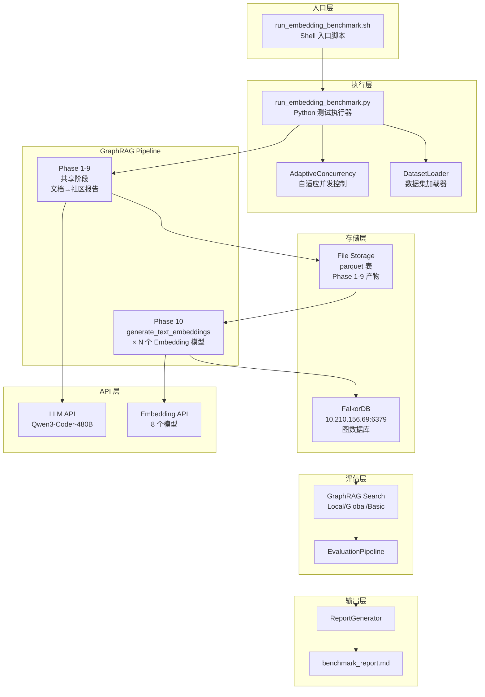
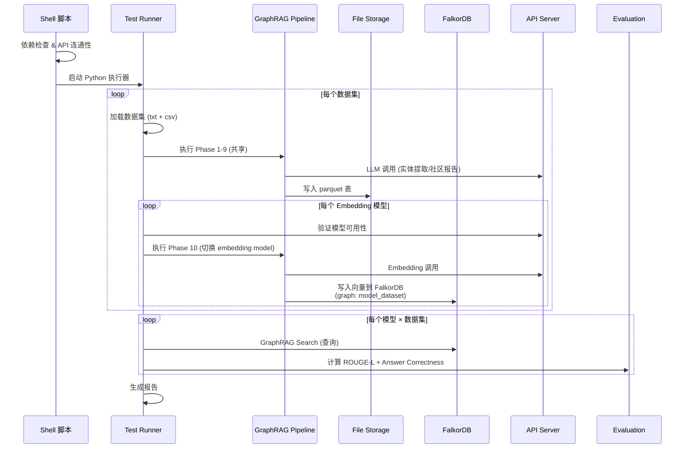

# 设计文档：Embedding 模型基准测试

## 概述

本设计文档描述了一个自动化 Embedding 模型基准测试系统的技术方案。该系统基于 **Microsoft GraphRAG**（代码位于 `/home/eyanpen/sourceCode/rnd-ai-engine-features/graphrag/`），利用其 10 阶段索引 pipeline 的可分割性，将 Phase 1-9（文档加载→社区报告生成）的结果作为共享基础，仅在 Phase 10（`generate_text_embeddings`）阶段切换不同 Embedding 模型，避免重复执行昂贵的 LLM 提取和社区检测步骤。

每个 Embedding 模型 × 数据集组合的结果存入 FalkorDB（`10.210.156.69:6379`），图数据库命名规则为 `<embedding_model_name>_<dataset_name>`。

系统核心设计决策：
- **Pipeline 分割优化**：Phase 1-9 每个数据集只执行一次，Phase 10 按 Embedding 模型数量执行 N 次，节省 ~90% 的 LLM 调用成本
- **GraphRAG 原生集成**：直接使用 Microsoft GraphRAG 的 `PipelineFactory` 和 workflow 系统，而非 fast-graphrag
- **FalkorDB 图存储**：每个模型+数据集组合使用独立的 FalkorDB 图数据库，支持并行查询和对比
- **远程 API 统一接入**：所有 Embedding 和 LLM 调用均通过 `http://10.210.156.69:8633` 的 OpenAI 兼容 API（LiteLLM provider）
- **容错优先**：单个模型/数据集失败不影响整体流程

## 架构

### GraphRAG Pipeline 分割策略

参考 `#[[file:docs/graphrag/graphrag-index-pipeline-deep-dive.md]]`，标准 pipeline 的 10 个阶段：

```
Phase 1:  load_input_documents        ─┐
Phase 2:  create_base_text_units       │
Phase 3:  create_final_documents       │
Phase 4:  extract_graph (LLM)         │ 共享阶段（每个数据集执行一次）
Phase 5:  finalize_graph               │ 输出: parquet 表 (entities, relationships,
Phase 6:  extract_covariates           │        communities, community_reports,
Phase 7:  create_communities           │        text_units, documents)
Phase 8:  create_final_text_units      │
Phase 9:  create_community_reports     ─┘
Phase 10: generate_text_embeddings     ← 按 Embedding 模型执行 N 次
```

Phase 10 对三类文本生成向量嵌入：
1. `text_unit.text` — TextUnit 原文
2. `entity.description` — 实体 title + description
3. `community_report.full_content` — 社区报告全文

### 整体架构



### 执行流程



## 组件与接口

### 1. Shell 入口脚本 (`tests/run_embedding_benchmark.sh`)

职责：环境准备、参数解析、依赖检查、API 连通性验证、调用 Python 执行器。

```bash
bash tests/run_embedding_benchmark.sh [OPTIONS]
  --sample N          # 每个数据集采样问题数，默认 5
  --dataset NAME      # kevin_scott|msft_multi|msft_single|hotpotqa|all，默认 kevin_scott
  --models "M1,M2"    # 逗号分隔的模型列表，默认全部 8 个
```

### 2. GraphRAG Pipeline 集成

#### Phase 1-9 共享执行

使用 GraphRAG 的 `PipelineFactory` 注册自定义 pipeline，仅包含 Phase 1-9：

```python
from graphrag.index.workflows.factory import PipelineFactory

# 注册不含 embedding 的 pipeline
_pre_embedding_workflows = [
    "create_base_text_units",
    "create_final_documents",
    "extract_graph",
    "finalize_graph",
    "extract_covariates",
    "create_communities",
    "create_final_text_units",
    "create_community_reports",
]
PipelineFactory.register_pipeline(
    "pre_embedding",
    ["load_input_documents", *_pre_embedding_workflows]
)
```

#### Phase 10 按模型执行

为每个 Embedding 模型动态修改 `GraphRagConfig.embedding_models` 配置，然后单独执行 `generate_text_embeddings` workflow：

```python
from graphrag.index.workflows.generate_text_embeddings import run_workflow

async def run_embedding_for_model(
    config: GraphRagConfig,
    context: PipelineRunContext,
    model_config: EmbeddingModelConfig,
):
    """为指定 Embedding 模型执行 Phase 10"""
    # 动态替换 embedding model 配置
    config.embedding_models["default_embedding_model"] = ModelConfig(
        model_provider="openai",  # LiteLLM 兼容
        model=model_config.name,
        api_base="http://10.210.156.69:8633",
        api_key="no-key",
    )
    # 配置 FalkorDB 向量存储
    graph_name = f"{sanitize_name(model_config.name)}_{dataset_name}"
    config.vector_store = VectorStoreConfig(
        type="falkordb",
        host="10.210.156.69",
        port=6379,
        graph_name=graph_name,
    )
    await run_workflow(config, context)
```

### 3. FalkorDB 集成

GraphRAG 原生不支持 FalkorDB，需要实现自定义 `VectorStore`：

```python
from graphrag_vectors import VectorStore, register_vector_store
import falkordb

class FalkorDBVectorStore(VectorStore):
    """FalkorDB 向量存储实现"""

    def __init__(self, host: str, port: int, graph_name: str, **kwargs):
        self.host = host
        self.port = port
        self.graph_name = graph_name
        self.db = None

    def connect(self):
        self.db = falkordb.FalkorDB(host=self.host, port=self.port)
        self.graph = self.db.select_graph(self.graph_name)

    def load_documents(self, documents, overwrite=True):
        """写入向量数据到 FalkorDB"""
        ...

    def similarity_search_by_vector(self, query_embedding, k=10, **kwargs):
        """向量相似度搜索"""
        ...

    def similarity_search_by_text(self, text, text_embedder, k=10, **kwargs):
        """文本相似度搜索"""
        ...

# 注册到 GraphRAG 工厂
register_vector_store("falkordb", FalkorDBVectorStore)
```

### 4. GraphRAG 配置 (`settings.yaml` 模板)

每个数据集生成独立的 `settings.yaml`：

```yaml
completion_models:
  default_completion_model:
    model_provider: openai
    api_base: "http://10.210.156.69:8633"
    api_key: "no-key"
    model: "Qwen/Qwen3-Coder-480B-A35B-Instruct-FP8"

embedding_models:
  default_embedding_model:
    model_provider: openai
    api_base: "http://10.210.156.69:8633"
    api_key: "no-key"
    model: "{EMBEDDING_MODEL}"  # Phase 10 时动态替换

vector_store:
  type: "falkordb"
  host: "10.210.156.69"
  port: 6379
  graph_name: "{MODEL_NAME}_{DATASET_NAME}"  # 动态生成

input_storage:
  type: file
  base_dir: "{DATASET_INPUT_DIR}"

output_storage:
  type: file
  base_dir: "tests/benchmark_results/workspace/{DATASET_NAME}/output"

cache:
  type: json
  storage:
    type: file
    base_dir: "tests/benchmark_results/workspace/{DATASET_NAME}/cache"

table_provider:
  type: parquet
```

### 5. FalkorDB 图数据库命名规则

每个 Embedding 模型 × 数据集组合对应一个独立的 FalkorDB 图：

| 模型 | 数据集 | 图名称 |
|------|--------|--------|
| BAAI/bge-m3 | kevin_scott | `bge-m3_kevin_scott` |
| BAAI/bge-m3/heavy | kevin_scott | `bge-m3_heavy_kevin_scott` |
| Qwen/Qwen3-Embedding-8B | hotpotqa | `qwen3-embedding-8b_hotpotqa` |

命名规则：`sanitize(model_name) + "_" + dataset_name`，其中 `sanitize()` 将 `/` 替换为 `-`，转小写。

### 6. 评估集成

查询阶段使用 GraphRAG 的 Search API（Local/Global/Basic Search），从 FalkorDB 检索相关上下文，然后用 LLM 生成答案：

```python
from graphrag.query.factory import create_local_search, create_global_search

# 每个模型+数据集组合创建独立的 search engine
search_engine = create_local_search(
    config=config,
    entities_df=entities_df,
    relationships_df=relationships_df,
    text_units_df=text_units_df,
    community_reports_df=community_reports_df,
    description_embedding_store=falkordb_store,  # 从 FalkorDB 读取
)
result = await search_engine.asearch(question)
```

评估指标直接调用 `GraphRAG-Benchmark/Evaluation/metrics/`：

```python
from Evaluation.metrics.rouge import compute_rouge_score
from Evaluation.metrics.answer_accuracy import compute_answer_correctness
```

### 7. AdaptiveConcurrencyController

复用 `run_fast_graphrag_test.py` 的自适应并发控制模式：

```python
class AdaptiveConcurrencyController:
    """自适应并发控制器"""
    def __init__(self, init: int = 10, min_val: int = 2, max_val: int = 50):
        ...
    def adjust(self, is_error: bool) -> None:
        """5xx 时并发 -1，连续 5 次成功时并发 +1"""
        ...
    def install_hooks(self) -> None:
        """Monkey-patch httpx.AsyncClient 注入节流和计时"""
        ...
```

### 8. DatasetLoader

```python
class DatasetLoader:
    """数据集加载器 — 从 GraphRAG-Benchmark/Datasets/ 加载语料和带 ground_truth 的问题"""
    @staticmethod
    def prepare_medical(datasets_root: str, output_dir: str) -> Optional[Tuple[List[Dict], str]]:
        """加载 medical.json 语料写入 output_dir，返回 (questions, corpus_name) 或 None"""
        ...
    @staticmethod
    def prepare_novel(datasets_root: str, output_dir: str) -> Optional[Tuple[List[Dict], str]]:
        """加载 novel.json 语料（20 篇小说各写一个 txt），返回 (questions, corpus_name) 或 None"""
        ...
```

问题 JSON 格式（medical_questions.json / novel_questions.json）：
```json
{
    "id": "Medical-73586ddc",
    "source": "Medical",
    "question": "What is the most common type of skin cancer?",
    "answer": "Basal cell carcinoma (BCC) is the most common type of skin cancer.",
    "question_type": "Fact Retrieval",
    "evidence": "Basal cell carcinoma (BCC) is the most common type of skin cancer."
}
```

`answer` 字段作为 ground_truth 传递给评估流程，确保 ROUGE-L 和 Answer Correctness 的评估有意义。

### 9. ReportGenerator

```python
class ReportGenerator:
    @staticmethod
    def generate_markdown(summary: BenchmarkSummary) -> str:
        """生成 Markdown 对比报告"""
        ...
    @staticmethod
    def generate_summary_json(summary: BenchmarkSummary) -> dict:
        """生成 JSON 汇总"""
        ...
```

## 数据模型

### 配置数据模型

```python
@dataclass
class EmbeddingModelConfig:
    name: str           # 模型名称，如 "BAAI/bge-m3"
    dim: int            # Embedding 维度
    max_tokens: int     # 最大 Token 数
    display_name: str   # 报告中显示的名称

EMBEDDING_MODELS = [
    EmbeddingModelConfig("BAAI/bge-m3", 1024, 8192, "BGE-M3 (default)"),
    EmbeddingModelConfig("BAAI/bge-m3/heavy", 1024, 8192, "BGE-M3 (heavy)"),
    EmbeddingModelConfig("BAAI/bge-m3/interactive", 1024, 8192, "BGE-M3 (interactive)"),
    EmbeddingModelConfig("intfloat/e5-mistral-7b-instruct", 4096, 4096, "E5-Mistral-7B"),
    EmbeddingModelConfig("intfloat/multilingual-e5-large-instruct", 1024, 512, "mE5-Large"),
    EmbeddingModelConfig("nomic-ai/nomic-embed-text-v1.5", 768, 8192, "Nomic-v1.5"),
    EmbeddingModelConfig("Qwen/Qwen3-Embedding-8B", 4096, 8192, "Qwen3-Emb-8B"),
    EmbeddingModelConfig("Qwen/Qwen3-Embedding-8B-Alt", 4096, 32768, "Qwen3-Emb-8B-Alt"),
]

@dataclass
class BenchmarkConfig:
    api_base_url: str = "http://10.210.156.69:8633"
    llm_model: str = "Qwen/Qwen3-Coder-480B-A35B-Instruct-FP8"
    falkordb_host: str = "10.210.156.69"
    falkordb_port: int = 6379
    sample_size: int = 5
    datasets: List[str] = field(default_factory=lambda: ["kevin_scott"])
    models: List[EmbeddingModelConfig] = field(default_factory=lambda: EMBEDDING_MODELS)
    output_dir: str = "tests/benchmark_results"
    data_root: str = "GraphRAG-Benchmark/Datasets"
    graphrag_root: str = "/home/eyanpen/sourceCode/rnd-ai-engine-features/graphrag"
```

### 结果数据模型

```python
@dataclass
class PredictionItem:
    """单条推理结果，兼容 GraphRAG-Benchmark 统一输出格式"""
    id: str
    question: str
    source: str
    context: List[str]
    generated_answer: str
    ground_truth: str
    error: Optional[str] = None

@dataclass
class EvaluationResult:
    model_name: str
    dataset_name: str
    rouge_l: float
    answer_correctness: float
    eval_time_seconds: float

@dataclass
class ModelResult:
    model: EmbeddingModelConfig
    dataset_name: str
    predictions: List[PredictionItem]
    evaluation: Optional[EvaluationResult]
    embedding_time_seconds: float   # Phase 10 耗时
    query_time_seconds: float
    error: Optional[str] = None

@dataclass
class DatasetPhaseResult:
    """数据集 Phase 1-9 共享阶段结果"""
    dataset_name: str
    phase_1_9_time_seconds: float
    output_dir: str                 # parquet 表所在目录
    error: Optional[str] = None

@dataclass
class BenchmarkSummary:
    config: BenchmarkConfig
    dataset_phases: List[DatasetPhaseResult]
    model_results: List[ModelResult]
    start_time: str
    end_time: str
    total_time_seconds: float
```

### 输出目录结构

```
tests/benchmark_results/
├── benchmark.log                          # 完整运行日志 (DEBUG)
├── benchmark_report.md                    # Markdown 对比报告
├── summary.json                           # 汇总 JSON
├── predictions/
│   ├── bge-m3__kevin_scott.json
│   ├── bge-m3_heavy__kevin_scott.json
│   └── ...
├── evaluations/
│   ├── bge-m3__kevin_scott.json
│   └── ...
└── workspace/
    ├── kevin_scott/                       # 每个数据集的 GraphRAG workspace
    │   ├── input/                         # 准备好的输入文件
    │   ├── output/                        # Phase 1-9 parquet 产物（共享）
    │   ├── cache/                         # LLM 调用缓存
    │   └── settings.yaml                  # GraphRAG 配置
    ├── msft_multi/
    ├── msft_single/
    └── hotpotqa/
```

FalkorDB 中的图数据库（每个模型×数据集一个）：
```
bge-m3_kevin_scott
bge-m3_heavy_kevin_scott
bge-m3_interactive_kevin_scott
e5-mistral-7b-instruct_kevin_scott
...（共 8 模型 × 4 数据集 = 32 个图）
```

## 正确性属性

### Property 1: 工作目录唯一性

*For any* 两个不同的 Embedding 模型名称，通过 `sanitize_name()` 生成的 FalkorDB 图名称应互不相同；且对于任意合法模型名称，生成的图名称应为合法的 FalkorDB 图标识符。

**Validates: Requirements 2.4**

### Property 2: 模型故障隔离

*For any* 模型列表，其中任意子集的模型在 Phase 10 或查询阶段抛出异常，Test_Runner 仍应为所有未失败的模型生成完整的测试结果。

**Validates: Requirements 2.5, 7.1**

### Property 3: Episode 分片合并正确性

*For any* 一组属于同一 Episode 的 part 文件（part1, part2, ..., partN），DatasetLoader 合并后的文本应按 part 编号升序包含所有分片内容。

**Validates: Requirements 3.1**

### Property 4: CSV 问题加载完整性

*For any* 合法 CSV 问题文件，DatasetLoader 返回的问题列表长度应等于 CSV 数据行数。

**Validates: Requirements 3.2**

### Property 5: 数据集故障隔离

*For any* 数据集列表，其中任意子集的数据集文件不存在或格式异常，Test_Runner 仍应为所有可正常加载的数据集完成测试。

**Validates: Requirements 3.6, 7.2**

### Property 6: Phase 1-9 共享正确性

*For any* 数据集，Phase 1-9 的 parquet 产物应只生成一次。对同一数据集的多个 Embedding 模型执行 Phase 10 时，读取的 parquet 表内容应完全一致。

**Validates: 设计决策 — Pipeline 分割优化**

### Property 7: 指标计算故障降级

*For any* 评估过程中某个指标计算抛出异常，该指标应记录为 NaN，其他指标正常返回。

**Validates: Requirements 5.4**

### Property 8: 报告章节完整性

*For any* 包含至少一个 ModelResult 的 BenchmarkSummary，报告应包含：测试环境信息、模型清单、指标对比表、BGE-M3 模式对比、总体排名、耗时统计。

**Validates: Requirements 6.2**

### Property 9: 最优值标注正确性

*For any* 指标对比表中的一列数值（至少 2 个非 NaN 值），最大值应被加粗标注。

**Validates: Requirements 6.4, 4.3**

### Property 10: 自适应并发控制不变量

*For any* AdaptiveConcurrencyController 配置（min ≤ init ≤ max），在任意 adjust() 调用序列后，并发数始终满足 min ≤ current ≤ max。5xx → -1，连续 5 成功 → +1，错误重置成功计数。

**Validates: Requirements 8.1, 8.2, 8.3**

### Property 11: FalkorDB 图命名唯一性

*For any* 两个不同的 (model_name, dataset_name) 组合，生成的 FalkorDB 图名称应互不相同。

**Validates: 设计决策 — FalkorDB 图存储**

## 错误处理

### 分层错误处理策略

| 层级 | 错误类型 | 处理方式 |
|------|---------|---------|
| Shell 入口 | 依赖缺失 | 输出缺失列表，尝试 `pip install`，失败则终止 |
| Shell 入口 | API/FalkorDB 不可达 | 输出错误信息，`exit 1` |
| 数据集级别 | Phase 1-9 失败 | 记录错误，跳过该数据集所有模型测试 |
| 模型级别 | Phase 10 失败 | 记录错误，跳过该模型，继续下一个 |
| 模型级别 | 查询异常 | 记录到 PredictionItem.error，继续下一个问题 |
| 数据集级别 | 文件不存在/格式异常 | 输出警告，跳过该数据集 |
| 评估级别 | 单指标计算失败 | 记录为 NaN，继续其他指标 |
| HTTP 级别 | 5xx 响应 | 自适应降低并发数 |

### 关键设计决策

1. **Phase 1-9 失败 = 整个数据集跳过**：因为 Phase 10 依赖 Phase 1-9 的 parquet 产物，如果共享阶段失败，该数据集的所有模型测试都无法进行。
2. **Phase 10 失败 = 仅跳过该模型**：其他模型仍可使用相同的 Phase 1-9 产物。
3. **FalkorDB 连接失败 = 硬性终止**：FalkorDB 是所有向量存储的唯一后端，不可降级。

## 测试策略

### 属性测试

使用 `pytest` + `hypothesis`，每个属性至少 100 次迭代。

| 属性 | 测试目标 | 生成器策略 |
|------|---------|-----------|
| Property 1 | `sanitize_name()` | 随机模型名称字符串 |
| Property 2 | 模型故障隔离 | 随机模型列表 + 失败注入 |
| Property 3 | Episode 合并 | 随机 part 文件内容 |
| Property 4 | CSV 解析 | 随机 CSV 内容 |
| Property 6 | Phase 共享 | 验证 parquet 表一致性 |
| Property 10 | 并发控制 | 随机 success/error 序列 |
| Property 11 | 图命名 | 随机 (model, dataset) 组合 |

### 集成测试

| 测试场景 | 说明 |
|---------|------|
| 端到端小规模 | `--sample 1 --dataset kevin_scott --models "BAAI/bge-m3"` |
| FalkorDB 连通性 | 验证图创建、写入、查询 |
| Phase 分割验证 | 验证 Phase 1-9 只执行一次 |
